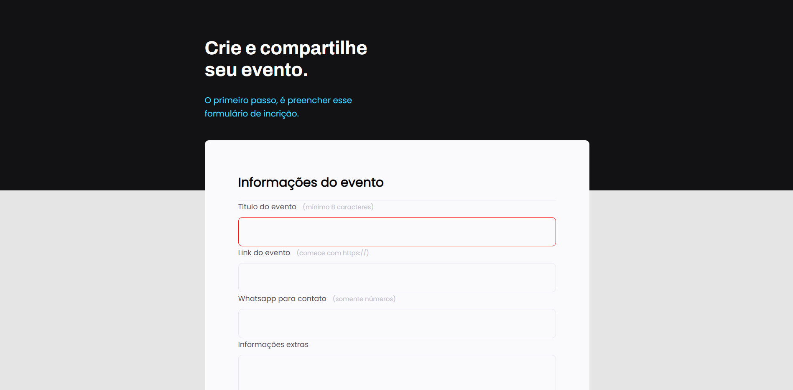

# 📚 Projeto 03 Formulário

[Acesse](https://prdsilva80.github.io/Projeto-03)

---

## 🛠️ Tecnologias

  

---

## 👨‍🎓 O que aprendi
 - Entendo os campos HTML
 - Como funcionam os formulários no HTML
 - Simulando a busca no google
 - Agrupando campos com fieldset e legend
 - Formatar o campo de texto
 - Ajustar novos campos dentro do fieldset
 - Estilizar o campo select
 - Aplicar estilos aos agrupamentos restantes
 - Checkbox customizado e com acessibilidade
 - Criando estilos para o submit
 - Validando campos e submetendo formulários

 ---

 ## 📧 Contato
 <a href = "mailto:probertos717@gmail.com">